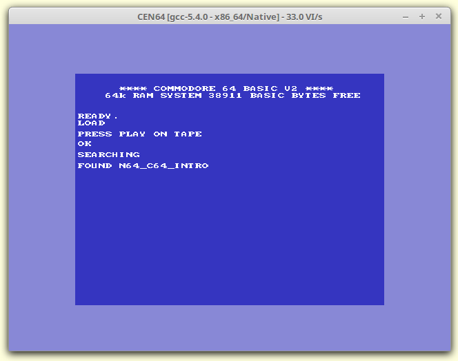
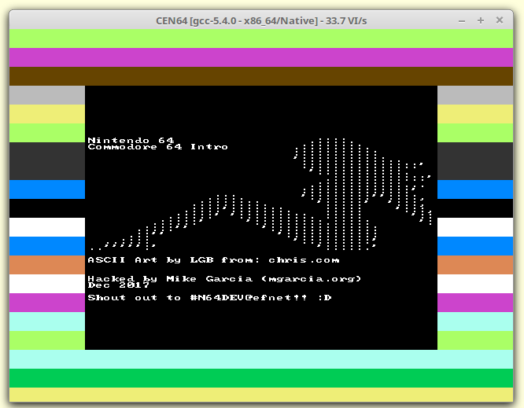
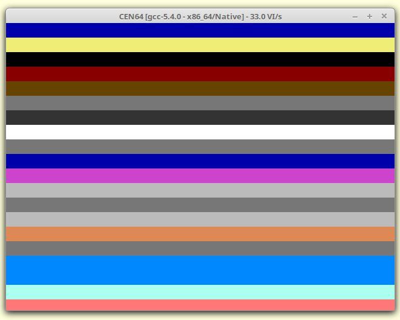

# Nintendo64-Commodore-64-Intro

Silly pretend C64 loading screen for N64 

Based on libdragon test.c example

A port of my Net Yaroze C64 demo from https://github.com/mgarcia-org/Net-Yaroze-Commodore-64-Intro/blob/master/C64Intro.c

Original page: http://mgarcia.org/2017/12/09/nintendo-n64-homebrew-starting-guide/

Archive: https://archive.is/POn1R

